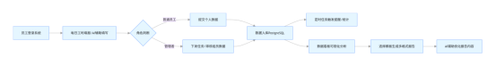
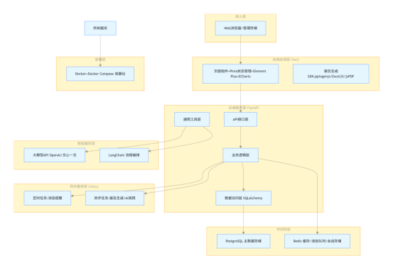

# 工时与项目协同管理系统 - 项目计划书&技术蓝图

**文档版本：**V1.0

**创建日期：**2026-02-03

**技术栈：**Python (FastAPI) + Vue3 + PostgreSQL + Redis + Docker + 大模型 API

**适用场景：**团队 / 个人工时填报、项目全生命周期管理、计划复盘、智能报告生成、多角色权限协同

## 目录

1. 项目总览

2. 产品功能蓝图

3. 技术架构蓝图

4. 核心模块详细设计

5. 数据库设计

6. 关键技术解决方案

7. 项目实施与开发计划

8. Docker 部署方案

9. 风险评估与应对措施

10. 扩展规划与迭代方向

# 1. 项目总览

## 1.1 项目背景

当前个人 / 团队存在工时填报零散、项目信息管理混乱、学习计划无跟踪、问题复盘不落地、报告手动生成效率低等痛点，缺乏统一的协同管理平台。结合 Python+Vue3+PostgreSQL 技术栈，搭建轻量化、可扩展的管理系统，实现工作数据标准化、流程自动化、分析可视化。

## 1.2 核心目标

- 标准化每日工时填报、项目信息、年度计划、问题复盘的数据格式

- 实现多角色权限管控，支持上下级任务下发与数据权限隔离

- 集成大模型实现智能工作量分析、报告内容生成

- 支持多格式（PPT/PDF/Word/Excel）模板化报告自动生成

- 基于 Docker 实现一键部署，兼容开发 / 测试 / 生产环境

- 构建数据看板，支撑项目、工时、计划的多维度分析

## 1.3 核心价值

| 维度     | 价值体现                                                    |
| -------- | ----------------------------------------------------------- |
| 效率提升 | 自动化填报提醒、AI 辅助分析、一键生成报告，降低手工操作成本 |
| 数据沉淀 | 统一存储工时 / 项目 / 计划数据，形成可追溯的工作资产        |
| 协同管理 | 多角色权限划分，支持任务下发、数据审批、跨层级查看          |
| 智能赋能 | 大模型集成实现工作量评估、报告生成、问题分析                |
| 部署便捷 | Docker 容器化部署，无环境依赖，快速落地                     |

# 2. 产品功能蓝图

基于需求拆解为11 大核心功能模块，覆盖数据录入、管理、分析、输出全流程，同时完善角色权限与业务流程设计。

## 2.1 角色权限体系（RBAC 基于角色的访问控制）

| 角色     | 权限范围         | 核心操作                                           |
| -------- | ---------------- | -------------------------------------------------- |
| 普通员工 | 个人数据权限     | 工时填报、个人计划管理、接收通知、查看个人统计     |
| 项目经理 | 项目组数据权限   | 项目维护、组员任务下发、项目数据统计、组员填报审核 |
| 技术经理 | 技术团队数据权限 | 技术问题复盘、研发效率分析、技术方案审批           |
| 部门经理 | 部门全数据权限   | 部门报表生成、人员绩效分析、计划统筹               |
| 项目总监 | 跨项目数据权限   | 项目进度监控、资源调配、整体报表导出               |
| 总经理   | 系统全数据权限   | 全局看板查看、系统配置、角色管理                   |

## 2.2 核心功能模块清单

| 模块编号 | 模块名称        | 核心功能点                                                 | 关联需求       |
| -------- | --------------- | ---------------------------------------------------------- | -------------- |
| 1        | 每日工作填报    | 工时增删改查、节假日 / 请假标记、干扰因素 / 备注录入       | 基础填报需求   |
| 2        | 项目信息维护    | 项目基础信息管理、本地 / 线上 / SVN 地址存储、环境版本记录 | 项目维护表     |
| 3        | 年度计划管理    | 按月拆分计划、进度跟踪、结果登记、风险备注管理             | 年度学习计划   |
| 4        | 工作问题复盘    | 问题分类录入、根因分析、整改措施跟踪、效果量化评估         | 工作问题表     |
| 5        | AI 智能工作计划 | 大模型分析工作内容、预估工时 / 难度、支持人工修正          | AI 工作量分析  |
| 6        | 消息通知系统    | 定时填报提醒、计划到期提醒、任务下发通知、已读管理         | 消息提醒       |
| 7        | 用户权限管理    | 用户增删改查、角色分配、权限配置、登录认证                 | 多角色用户系统 |
| 8        | 项目统计分析    | 项目负责人 / 周期 / 总工时 / BUG 数统计、自定义字段扩展    | 项目统计表     |
| 9        | 数据可视化看板  | ECharts 图表展示：工时分布、项目占比、计划完成率           | 数据分析看板   |
| 10       | 智能报告生成    | 数据汇总 + AI 润色、报告预览 / 导出                        | 自动报告生成   |
| 11       | 模板化报告导出  | 按部门 / 角色匹配模板，支持 PPT/PDF/Word/Excel 导出        | 多格式模板报告 |

## 2.3 核心业务流程

### 普通员工流程

1. 员工登录系统

2. 每日工时填报/AI辅助填写

3. 提交个人数据

4. 数据入库PostgreSQL

5. 接收定时任务触发提醒/查看个人统计

### 管理者流程

1. 管理者登录系统

2. 下发任务/审核组员数据

3. 数据入库PostgreSQL

4. 通过数据看板可视化分析数据

5. 选择模板生成多格式报告

6. AI辅助优化报告内容



# 3. 技术架构蓝图

采用前后端分离 + 分层架构设计，兼顾高性能、可扩展性、容器化部署需求，集成异步任务与大模型服务。


## 3.1 整体架构分层

从下至上依次为：部署层 → 智能服务层 → 异步服务层 → 中间件层 → 后端服务层 → 前端应用层 → 接入层

- 接入层：Web浏览器/管理终端

- 前端应用层：页面组件+Pinia状态管理+Element Plus+ECharts、报告生成SDK(pptxgenjs/ExcelJS/jsPDF)

- 后端服务层：API接口层、业务逻辑层、数据访问层(SQLAlchemy)、通用工具层

- 中间件层：PostgreSQL 主数据存储、Redis 缓存/消息队列/会话存储

- 异步服务层：Celery（定时任务:消息提醒；异步任务:报告生成/AI调用）

- 智能服务层：大模型API(OpenAI/文心一言)、LangChain 流程编排

- 部署层：Docker+Docker Compose 容器化（承载所有服务）

## 3.2 技术栈明细

| 架构层级    | 技术选型                               | 选型说明                                    |
| ----------- | -------------------------------------- | ------------------------------------------- |
| 前端        | Vue3 + Vite + Pinia + Element Plus     | 组合式 API 开发，高效构建表单 / 表格 / 看板 |
| 前端工具    | ECharts + ExcelJS + jsPDF + pptxgenjs  | 可视化图表、多格式文件生成                  |
| 后端        | FastAPI + Pydantic v2 + SQLAlchemy 2.0 | 高性能 API、数据校验、ORM 操作              |
| 权限认证    | JWT + Passlib                          | 无状态认证、密码加密存储                    |
| 数据库      | PostgreSQL 15+                         | 支持 JSONB / 复杂查询，适配灵活字段         |
| 缓存 / 队列 | Redis 7+                               | 接口缓存、定时任务 Broker、会话存储         |
| 异步任务    | Celery                                 | 处理定时提醒、报告生成等耗时操作            |
| AI 集成     | 大模型 API + LangChain                 | 智能分析、内容生成、语义理解                |
| 部署方案    | Docker + Docker Compose                | 容器化隔离，一键启动全链路服务              |
| 版本管理    | Git                                    | 代码迭代与团队协作                          |

## 3.3 项目目录结构

### 3.3.1 后端目录（FastAPI）

```plaintext
work-management-backend/
├── app/
│   ├── api/v1/           # 接口路由：用户/填报/项目/计划/报告等
│   ├── core/             # 核心配置：数据库、JWT、全局配置
│   ├── crud/             # 通用CRUD操作封装
│   ├── models/           # SQLAlchemy数据库模型
│   ├── schemas/          # Pydantic请求/响应模型
│   ├── utils/            # 工具类：AI、文件生成、日期、通知
│   ├── worker/           # Celery定时/异步任务
│   └── dependencies.py   # 接口依赖：登录校验、权限校验
├── Dockerfile             # 后端容器构建文件
├── requirements.txt       # Python依赖清单
├── docker-compose.yml    # 全服务编排配置
└── main.py               # 项目入口文件
```

### 3.3.2 前端目录（Vue3）

```plaintext
work-management-frontend/
├── src/
│   ├── api/              # 后端接口封装
│   ├── components/        # 公共组件：表单、表格、看板、上传
│   ├── views/             # 业务页面：填报/项目/计划/报告等
│   ├── pinia/             # 全局状态管理
│   ├── router/            # 路由配置+权限拦截
│   ├── utils/             # 前端工具：请求封装、文件处理
│   └── assets/            # 静态资源、报告模板
├── Dockerfile             # 前端容器构建文件
├── vite.config.js         # 构建配置
└── package.json           # 前端依赖清单
```

# 4. 核心模块详细设计

## 4.1 模块 1：每日工作填报

**核心字段：**日期、项目、工作内容、难易 / 紧急程度、工作类型、实际工时、干扰因素、备注

**扩展功能：**自动填充当前日期、节假日 / 请假状态标记、批量导入 / 导出、历史数据筛选

**接口设计：**增删改查、按用户 / 日期 / 项目筛选、数据校验

## 4.2 模块 2：项目信息维护

**核心字段：**项目名称、本地路径、线上地址、SVN 地址、备注、Node 版本、负责人、开发周期

**关联能力：**与工时填报模块联动，下拉选择项目，避免重复录入

## 4.3 模块 3：年度计划管理

**核心字段：**年份 / 月份、计划内容、时间节点、目标、完成状态、难度、文档地址、风险备注

**核心能力：**按月筛选、进度统计、逾期标记、计划导出

## 4.4 模块 4：工作问题复盘

**核心字段：**问题分类、核心问题、根因、整改措施、整改效果、量化目标、备注

**核心能力：**按年份 / 问题类型筛选、整改效果跟踪统计

## 4.5 模块 5：AI 智能工作计划

**核心能力：**输入工作内容→大模型分析→输出预估工时、难度、建议周期→用户手动修正

**兼容方案：**API 异常时降级为默认规则计算

## 4.6 模块 6：消息通知系统

**通知类型：**每日填报提醒、计划到期提醒、任务下发通知

**推送方式：**系统内消息中心 + 标记已读 / 未读，支持后续扩展邮件 / 企业微信推送

**触发方式：**Celery 定时任务 + 实时接口触发

## 4.7 模块 7：用户权限管理

**核心能力：**用户注册 / 登录 / 禁用、角色分配、接口级权限控制、数据级权限隔离

**安全设计：**密码加密存储、JWT 令牌过期机制、接口访问限流

## 4.8 模块 8：项目统计分析（补充字段）

基于需求扩展标准化字段，满足管理统计需求：

| 字段名称         | 类型    | 说明                               |
| ---------------- | ------- | ---------------------------------- |
| project_id       | INT     | 关联项目基础表                     |
| leader_name      | VARCHAR | 项目负责人                         |
| total_hours      | NUMERIC | 项目累计工时                       |
| develop_cycle    | INT     | 开发周期（天）                     |
| bug_count        | INT     | BUG 修复次数                       |
| project_status   | VARCHAR | 项目状态（进行中 / 已完结 / 挂起） |
| priority         | VARCHAR | 项目优先级                         |
| delivery_quality | VARCHAR | 交付质量评级                       |

## 4.9 模块 9：数据可视化看板

**图表类型：**工时月度趋势图、项目类型占比饼图、工作类型分布柱状图、计划完成率折线图

**筛选维度：**按用户 / 时间 / 项目 / 角色多维度过滤

## 4.10 模块 10：智能报告生成

**流程：**选择统计范围→拉取汇总数据→AI 生成分析文案→预览→导出

**集成能力：**对接大模型自动润色报告总结、问题分析内容

## 4.11 模块 11：模板化报告导出

**支持格式：**PPT/PDF/Word/Excel

**模板规则：**按部门 / 角色绑定模板，支持自定义模板上传与管理

**核心依赖：**前端专用 SDK 实现文件生成与下载

# 5. 数据库设计

基于 PostgreSQL 设计10 张核心业务表，满足全模块数据存储，采用JSONB类型适配灵活字段，建立外键关联保证数据一致性。

## 5.1 核心表结构（精简版）

```sql
-- 1. 用户表
CREATE TABLE sys_user (id SERIAL PRIMARY KEY, username VARCHAR(50) UNIQUE, password VARCHAR(100), real_name VARCHAR(50), role_id INT, status SMALLINT, create_time TIMESTAMP DEFAULT NOW());
-- 2. 角色权限表
CREATE TABLE sys_role (id SERIAL PRIMARY KEY, role_name VARCHAR(50), role_code VARCHAR(50) UNIQUE, permissions JSONB);
-- 3. 每日工作填报表
CREATE TABLE work_daily (id SERIAL PRIMARY KEY, user_id INT, work_date DATE, project_name VARCHAR(200), work_content TEXT, difficulty VARCHAR(20), urgency VARCHAR(20), work_type VARCHAR(50), actual_hours NUMERIC(5,1), interference TEXT, remark TEXT, FOREIGN KEY (user_id) REFERENCES sys_user(id));
-- 4. 项目基础信息表
CREATE TABLE project_info (id SERIAL PRIMARY KEY, project_name VARCHAR(200) UNIQUE, local_path TEXT, online_url TEXT, svn_url TEXT, node_version VARCHAR(10), leader_id INT, remark TEXT);
-- 5. 项目统计表
CREATE TABLE project_statistic (id SERIAL PRIMARY KEY, project_id INT, total_hours NUMERIC, bug_count INT, project_status VARCHAR(20), FOREIGN KEY (project_id) REFERENCES project_info(id));
-- 6. 年度计划表
CREATE TABLE annual_plan (id SERIAL PRIMARY KEY, user_id INT, year INT, month INT, plan_content TEXT, target TEXT, result VARCHAR(20), difficulty VARCHAR(20), document_url TEXT, remark TEXT);
-- 7. 工作问题复盘表
CREATE TABLE work_problem (id SERIAL PRIMARY KEY, user_id INT, year INT, category VARCHAR(50), core_problem TEXT, root_cause TEXT, rectify_measure TEXT, effect VARCHAR(20));
-- 8. 消息通知表
CREATE TABLE sys_message (id SERIAL PRIMARY KEY, receiver_id INT, title VARCHAR(100), content TEXT, msg_type VARCHAR(20), is_read SMALLINT DEFAULT 0);
-- 9. 报告模板表
CREATE TABLE report_template (id SERIAL PRIMARY KEY, template_name VARCHAR(100), dept VARCHAR(50), role VARCHAR(50), template_type VARCHAR(20), content JSONB);
-- 10. 任务下发表
CREATE TABLE work_task (id SERIAL PRIMARY KEY, publisher_id INT, receiver_id INT, task_content TEXT, deadline DATE, status VARCHAR(20));
```

## 5.2 索引优化

为高频查询字段建立索引，提升系统性能：

```sql
CREATE INDEX idx_work_daily_user_date ON work_daily(user_id, work_date);
CREATE INDEX idx_project_statistic_project ON project_statistic(project_id);
CREATE INDEX idx_annual_plan_user_year ON annual_plan(user_id, year);
```

# 6. 关键技术解决方案

## 6.1 权限控制方案

采用RBAC 权限模型，实现接口权限+数据权限双层管控：

- 接口权限：路由拦截 + JWT 解析角色，拒绝无权限接口访问

- 数据权限：普通员工仅查看个人数据，管理者查看团队 / 部门数据

## 6.2 消息通知方案

- 定时提醒：Celery Beat 配置固定时间（如每日 17:00）触发填报提醒任务

- 实时通知：任务下发时直接调用接口写入消息表

- 前端交互：消息中心轮询 /websocket 实时推送，支持已读标记

## 6.3 AI 集成方案

- 接入国内大模型（文心一言 / 通义千问）适配中文场景

- LangChain 封装标准化 Prompt，实现工作量分析、报告生成

- 异常降级机制：API 调用失败时，使用规则引擎返回默认值

## 6.4 多格式报告生成方案

| 格式  | 技术方案   | 适用场景               |
| ----- | ---------- | ---------------------- |
| Excel | ExcelJS    | 数据明细导出、表格统计 |
| PDF   | jsPDF      | 正式报告、不可编辑文档 |
| PPT   | pptxgenjs  | 年度汇报、可视化展示   |
| Word  | mammoth.js | 可编辑文档、文案编辑   |

# 7. 项目实施与开发计划

分5 个阶段迭代开发，优先落地核心功能，逐步扩展智能与高级特性：

| 阶段                   | 周期 | 核心交付物                                 | 里程碑                    |
| ---------------------- | ---- | ------------------------------------------ | ------------------------- |
| 阶段 1：环境搭建与原型 | 1 周 | 前后端基础框架、数据库初始化、Docker 配置  | 服务可本地 / 容器启动     |
| 阶段 2：核心功能开发   | 2 周 | 填报、项目维护、用户权限、基础 CRUD 接口   | 基础数据管理能力落地      |
| 阶段 3：进阶功能开发   | 2 周 | 计划管理、问题复盘、消息通知、项目统计     | 完整业务流程闭环          |
| 阶段 4：智能与可视化   | 2 周 | AI 工作量分析、数据看板、报告生成          | 智能分析 + 可视化能力上线 |
| 阶段 5：测试优化与部署 | 1 周 | 全流程测试、Bug 修复、容器化部署、文档完善 | 系统正式上线运行          |

# 8. Docker 部署方案

## 8.1 部署架构

基于Docker Compose编排7 个容器服务，实现一键启动全链路系统：

前端服务、后端服务、PostgreSQL、Redis、Celery Worker、Celery Beat、Nginx

## 8.2 核心配置文件

docker-compose.yml 核心片段（完整配置见技术架构）：

```yaml
version: '3.8'
services:
    postgres:
        image: postgres:15-alpine
        restart: always
        volumes: [postgres_data:/var/lib/postgresql/data]
    redis:
        image: redis:7-alpine
        restart: always
    backend:
        build: ./work-management-backend
        depends_on: [postgres, redis]
    frontend:
        build: ./work-management-frontend
        depends_on: [backend]
    celery-worker:
        build: ./work-management-backend
        command: celery -A app.worker.celery worker
    celery-beat:
        build: ./work-management-backend
        command: celery -A app.worker.celery beat
volumes:
    postgres_data:
```

## 8.3 部署命令

```bash
运行
# 构建并启动所有服务
docker-compose up -d --build
# 查看服务运行状态
docker-compose ps
# 停止服务
docker-compose down
```

# 9. 风险评估与应对措施

| 风险类型 | 风险描述                       | 应对方案                                   |
| -------- | ------------------------------ | ------------------------------------------ |
| 技术风险 | 大模型 API 调用超时 / 费用超标 | 增加请求缓存、设置调用配额、降级为规则引擎 |
| 功能风险 | 多格式文件生成兼容性问题       | 优先兼容主流浏览器，提供备用导出格式       |
| 部署风险 | 容器环境网络 / 端口冲突        | 标准化端口配置，提供环境变量自定义方案     |
| 数据风险 | 数据丢失 / 误删除              | 开启数据库定时备份，增加数据软删除机制     |
| 进度风险 | 功能迭代延期                   | 采用敏捷开发，优先保障核心模块交付         |

# 10. 扩展规划与迭代方向

## 10.1 短期扩展（3 个月内）

- 集成企业微信 / 钉钉消息推送

- 增加填报数据审批流程

- 优化报告模板自定义编辑器

## 10.2 中长期扩展（6-12 个月）

- 多租户架构，支持多团队独立使用

- 移动端 H5 / 小程序适配

- 接入本地大模型，实现私有化部署

- 对接 SVN/Git，自动同步项目代码状态

- 基于 K8s 实现集群化部署与弹性扩容

# 附录：文档说明

- 本文档为Markdown格式，可直接保存为 project-blueprint.md，支持 GitHub、VSCode、Typora 等工具预览

- 配套文件：docker-compose.yml、requirements.txt、package.json 可基于本文档架构快速生成

- 数据库 SQL 脚本可直接复制执行，初始化系统基础表结构
